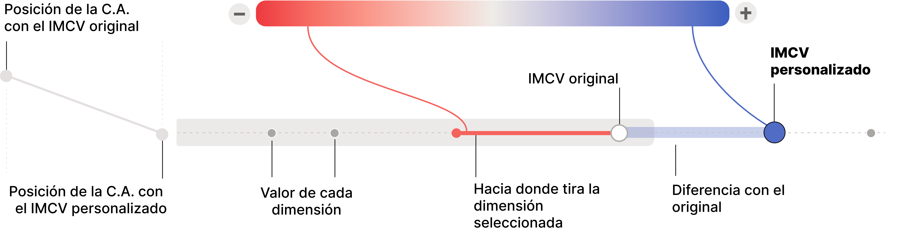

```js
import {data as imcv, ccaaList, ccaaColors, dimList, dimDict, yearTexts} from "./data/consts.js";
import {customIndexChart} from "./components/customIndexChart.js"
import {filterLegend} from "./components/filterLegend.js";
import {flowerChart} from "./components/flowerChart.js";
import {slopeChart} from "./components/slopeChart.js";
import {lineChart} from "./components/lineChart.js";
import {tilemap} from "./components/tileMap.js";

//if not here not working
const data = await FileAttachment("data/imcv.json").json();
const imcvKey = await FileAttachment("data/images/IMCVKey.png").image();

const yearInput = Inputs.range(d3.extent(imcv.map((d) => d.year)), {
    label: "Selecciona el año",
    step: 1,
    value: 2022
  });
const year = Generators.input(yearInput);


const ccaaInput = filterLegend(ccaaList.filter(d => d !== "Total"), ccaaColors.filter(d =>  d !== "#797974"))
const ccaa = Generators.input(ccaaInput);
```

```js
const clickedSlider = Mutable("None");
const setClickedSlider = (x) => (clickedSlider.value = x);
 
const weightsInput = Inputs.form(
  d3.range(0, 9).map((d) => {
    const slider = Inputs.range([1, 10], {
      label: dimDict[dimList[d]],
      step: 1,
      value: 1
    });

    slider.addEventListener("mousedown", (event) => {
      setClickedSlider(dimList[d]);
    });

    slider.addEventListener("mouseup", (event) => {
      setClickedSlider("None");
    });

    return slider;
  })
);

weightsInput.classList.add("weight-inputs");

const weights = Generators.input(weightsInput);
```

```js
const isSimpleCheckbox = Inputs.radio([true, false], {label: "Show", value: false, format: (x) => x === true ? "Simple view" : "Detailed view"});

const isSimple = Generators.input(isSimpleCheckbox);
```

```js
const groupedByYearAndRegion =
  imcv 
  .reduce((acc, curr) => {
    if (curr.year === year) {
      if (!acc[curr.ccaa]) {
        acc[curr.ccaa] = [];
      }
      acc[curr.ccaa].push(curr);
    }
    return acc;
  }, {});
```

```js
const customAmpi = [];
const selectedYearScores = [];

for (const region of ccaaList) {
  const regionData = groupedByYearAndRegion[region];

  let weightedSum = 0;
  let totalMultiplier = 0;
  let indexValue = null;

  for (const curr of regionData) {
    if (curr.dim === 'index') {
      indexValue = curr.val;
    } else {
      const dimIndex = parseInt(curr.dim.replace("dim", "")) - 1;
      const multiplier = weights[dimIndex];
      weightedSum += curr.val * multiplier;
      totalMultiplier += multiplier;
    }
  }

  const weightedAverage = weightedSum / totalMultiplier;
  customAmpi.push({ ccaa: region, val: weightedAverage });
  selectedYearScores.push({ ccaa: region, val: indexValue });
}
console.log(customAmpi)
```

```js
const sortedCustomAmpi = customAmpi.slice().sort((a, b) => b.val - a.val);
const sortedSelectedYearScores = selectedYearScores.slice().sort((a, b) => b.val - a.val);

const slopePositions = sortedSelectedYearScores.flatMap((cur, i) => {
  const initialPosition = i + 1;
  const finalPosition = sortedCustomAmpi.findIndex((item) => item.ccaa === cur.ccaa) + 1;

  return [
    { ccaa: cur.ccaa, stage: "initial", position: initialPosition },
    { ccaa: cur.ccaa, stage: "final", position: finalPosition }
  ];
});

const dimensionDiffs = {};
for (const [key, entries] of Object.entries(groupedByYearAndRegion)) {
  const avg = customAmpi.find((p) => p.ccaa === key).val;

  const ccaaValues = entries.reduce((acc, obj) => {
    acc[obj.dim] = {
      avg: avg,
      dimVal: obj.val,
      diff: avg - obj.val
    };
    return acc;
  }, {});

  dimensionDiffs[key] = ccaaValues;
}
```

# La calidad de vida en España

<div class="grid grid-charts">
  <div class="header">
    <h2>¿Cuáles son las comunidades autónomas con mejor calidad de vida?</h2>
    <p>${yearTexts[year]} A continuación puedes explorar los valores de las dimensiones para cada comunidad autónoma para el año seleccionado.</p>
  </div>
  <div class="menu sticky"> ${yearInput} </div>
  
  <div class="card center chart"> 
    ${
      flowerChart(
        imcv,
        "Total",
        year,
        "val", 
        "dim",
        width > 600 ? width / 12 : width / 6)
      }
  </div>
  
  ${yearInput}
  
  </div>
  <div class="card center" style="overflow-x: auto;">
      ${
        tilemap(imcv, year, width > 1200 ? width*.65 : width )
      }
  </div>
</div>

<div class="grid grid-charts">
  <div class="header">
    <h2>¿Cómo han evolucionado las dimensiones del índice?</h2>
    <p>En estos gráficos puedes explorar la tendencia de cada comunidad autónoma y cada dimensión. La única dimensión que crece de manera relativamente consistente es Educación. Las más cambiantes son Trabajo —especialmente en momentos de crisis, Salud —muy variable de año en año, y Condiciones materiales de vida, Seguridad física y personal y Entorno y medioambiente con variaciones significativas entre años y entre comunidades autónomas. En contraste, Gobernanza y derechos básicos, Ocio y relaciones sociales< y Experiencia general de la vida se mantienen con fluctuaciones mínimas.</p>
  </div>
  
  <div class="sticky menu menu-tendencias">
    ${ccaaInput}
    <p class="notes">Para asegurar la legibilidad de las gráficas, el filtro sólo te permite comparar hasta seis CC.AA. a la vez.</p>
  </div>

  <div class="card chart">
     <h3>Evolución del índice</h3>
      ${lineChart(imcv, ccaa, "index", width, 240, "year", "val", "ccaa")}
  </div>

  <div class="map">
    ${
      dimList.map(d => html`
      <div class="card">
        <h3>${dimDict[d]}</h3>
        ${lineChart(imcv, ccaa, d, width, 240, "year", "val", "ccaa")}
      </div>
      `)
    }
  </div>
</div>


<div class="grid grid-chart-weight">
  <div class="header">
    <h2>TK TK Interactivo lorem ipsum título</h2>
    <p>Interacciona con los sliders para customizar el IMCV según tus prioridades. Explora cómo afecta a la puntuación de cada C.A.</p>
  </div>
  
  <div class="sticky menu menu-dimensiones">
    ${weightsInput}
    ${isSimpleCheckbox}
  </div>

  <div class="card image-chart" >
    
  </div>

  <div class="weights-chart card">
    ${slopeChart(slopePositions, 700)}
    ${customIndexChart(imcv, customAmpi, dimensionDiffs, clickedSlider, year, 700, isSimple)} 
  </div>
</div>


<!--div class="grid grid-custom-index">
  <div  class="header">
    <h2>TK TK Interactivo lorem ipsum título</h2>
    <p> Interacciona con los sliders para customizar el IMCV según tus prioridades. Explora cómo afecta a la puntuación de cada C.A. </p>
  </div>

  <div class="card">
      ${imcvKey}
  </div>

  <div class="sticky menu">
    ${weightsInput}
    ${isSimpleCheckbox}
  </div>

  <div class="chart card" style="display:flex">
    <div style="flex:1"> 
      ${slopeChart(slopePositions, 800)}
    </div>
    <div style="flex:7"> 
      ${customIndexChart(imcv, customAmpi, dimensionDiffs, clickedSlider, year, 800, isSimple)} 
    </div>
  </div>
</div-->


<style>

  .grid-chart-weight {
    display: grid;
    grid-template-columns: 1fr 2fr;
    grid-template-rows: auto auto 1fr;
    grid-template-areas: 
      "header  chart"
      "menu map ";
    gap: 8px;
  }

  .weight-inputs {
    display: grid;
    grid-template-columns: 1fr;
    gap: 2px;
  }

  .menu-dimensiones {
    overflow-y: auto;
    z-index: 10;
  }

  .grid-charts {
    display: grid;
    grid-template-columns: repeat(4, 1fr);
    grid-template-rows: auto 1fr;
    grid-template-areas: 
      "header header header chart"
      "menu map map map";
    gap: 8px;
  }

  .header {
    grid-area: header;
  }

  .menu {
    grid-area: menu;
    background: #f2f2f2; 
    padding: 10px;
  }

  .menu-tendencias {
    overflow-y: auto;
    z-index: 10;
  }

  .chart {
    grid-area: chart;
  }

  .image-chart {
    grid-area:chart;
    align-self:end;
    justify-self:end;
  }

  .map {
    grid-area: map;
    display: grid;
    grid-template-columns: repeat(3, 1fr); 
    gap: 2px; 
  }

  .weights-chart {
    grid-area: map;    
    display: grid;
    grid-template-columns: 1fr 6fr; 
  }

  @media (max-width: 1536px) {
    .weight-inputs {
      grid-template-columns: repeat(2, 1fr);
    }

    .grid-chart-weight {
      grid-template-columns: repeat(5, 1fr);
      grid-template-areas: 
        "header header chart chart chart"
        "menu menu menu menu menu"
        "map map map map map";
    }  
  }

  @media (max-width: 1280px) {
    .grid-chart-weight {
      grid-template-rows: auto auto auto 1fr;
      grid-template-areas: 
        "header header header header header"
        "chart chart chart chart chart"
        "menu menu menu menu menu"
        "map map map map map";
    } 

    .image-chart {
      justify-self:start;
    }
  }

  @media (max-width: 1024px) {
    .grid-charts {
      grid-template-columns: 1fr 1fr;
      grid-template-rows: auto auto 1fr;
      grid-template-areas: 
        "header header"
        "menu chart"
        "map map";
    }
    .grid-custom-index {
      grid-template-columns: 1fr 1fr 1fr;
      grid-template-rows: auto auto 1fr;
      grid-template-areas:
        "header header header"
        "card card card"
        "menu chart chart";
    }
    .menu-tendencias {
      height: 300px;
    }

    
  }

  @media (max-width: 850px) {
    .weight-inputs {
      grid-template-columns: 1fr;
    }
  }
  
  @media (max-width: 640px) {
    .grid-charts {
      grid-template-columns: 1fr;
      grid-template-rows: auto auto auto 1fr;
      grid-template-areas: 
        "header"
        "menu"
        "chart"
        "map";
    }
    .menu-tendencias {
      height: 200px;
    }
    .menu-dimensiones {
      height: 200px;
    }
    .map {
      grid-template-columns: 1fr !important;
    }
    .header, .menu, .chart, .map {
      width: auto; 
    }
  }
</style>
