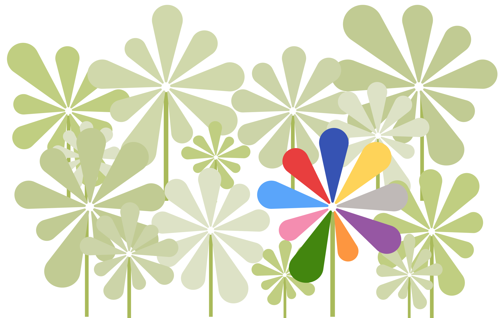

  

    <h1>Índice de Calidad de Vida (INE)</h1>
      <h2>El IMCV es un indicador experimental desarrollado por el Instituto Nacional de Estadística de España (INE) construido a partir de 60 indicadores específicos agrupados en nueve dimensiones, que ofrece una visión general de la calidad de vida en España.
    </h2>
  

  

<!-- <iframe id="iframe" scrolling="no" src="https://sequera.fndvit.org/"></iframe> -->

  

    <h2><a href="imcv-dashboard">Panel del índice multidimensional de calidad de vida (IMCV)</a></h2>
  

  

    <h2><a href="making-of">Cómo (y por qué) lo rehicimos</a></h2>
  

  

    <h2><a href="data">Descarga los datos</a></h2>
  

--- 

TK TK TK TK <a href="mailto:karma@fundaciovit.org">karma@fundaciovit.org</a>.
