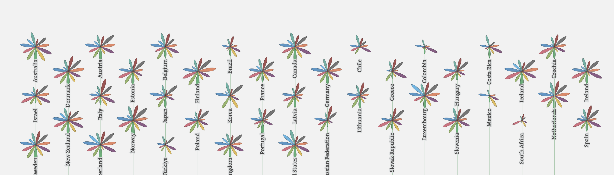
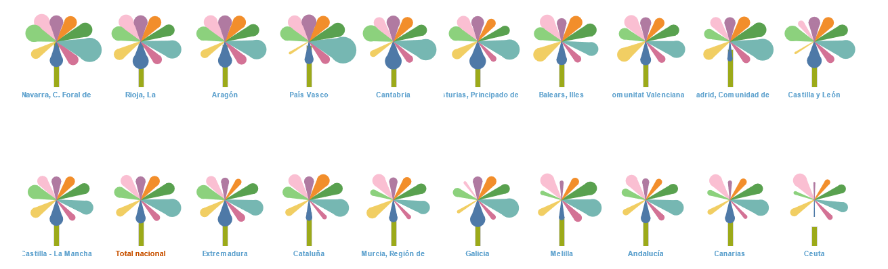
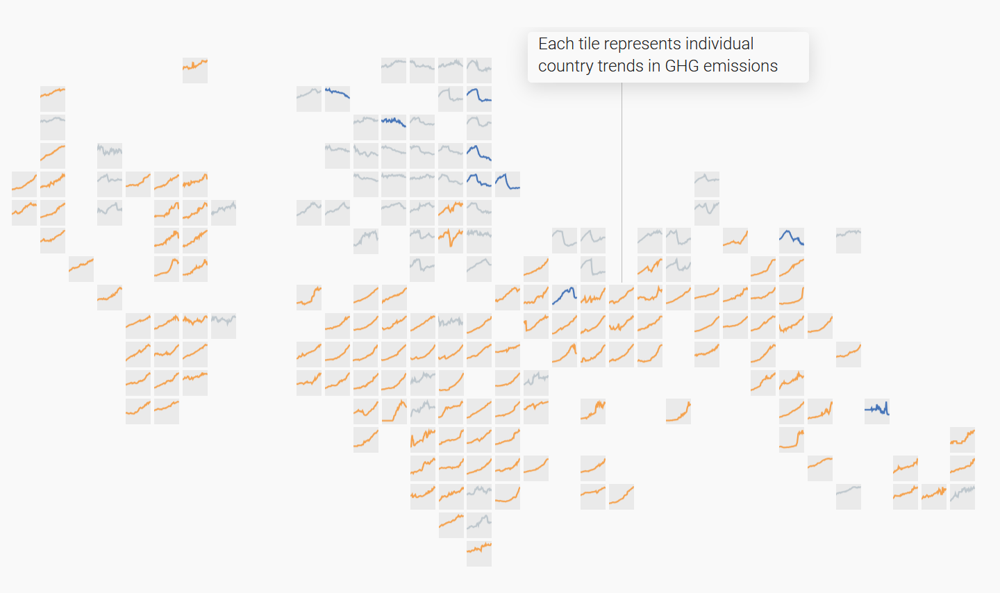

```js
import {data as imcv, ccaaList} from "./data/consts.js";
import {flowerChart} from "./components/flowerChart.js";
import {lineChart} from "./components/lineChart.js";
import {tilemap} from "./components/tileMap.js";

//if not here not working
const data = await FileAttachment("data/imcv.json").json();
```

# Cómo (y por qué) rehicimos el Indicador del INE
Como viene siendo habitual cuando reimaginamos [otras aplicaciones de datos públicos abiertos](https://sequera.fndvit.org/), el objetivo de este esfuerzo es **celebrar los datos abiertos**. Ya es emocionante que los datos existan, pero cuando se acompañan de una visualización que nos ayuda a comprenderlos y explorarlos, ¡es aún más emocionante! Y, como siempre, hemos respetado el diseño original al tiempo que intentamos mejorar la claridad y la usabilidad del mismo.

Y al igual que con nuestra iniciativa **[Catalunya en Dades](https://catalunya-en-dades.fndvit.org/)**, utilizamos [Observable, un generador de sitios estáticos gratuito y de código abierto](https://github.com/observablehq/framework) para aplicaciones de datos, en lugar de productos de software comerciales como _Tableau_ (la herramienta utilizada por el INE en este caso) o _Power BI_ (la herramienta utilizada por la administración catalana).

<div class="figure-container">
    <figure>
        
        <figcaption>Pagina de MQLI (IMCV en Español) un indicador experimental sobre la calidad de vida desarrollado por el instituto nacional de estadistica (INE)</figcaption>
    </figure>
</div>

---
## **Nos chiflan** las flores
La visualización principal es un puñado de **flores multicolores**, una para cada comunidad autónoma. En cada flor, cada pétalo representa una de las nueve dimensiones del índice y la longitud —y grosor— de cada pétalo representa el valor de esa dimensión en la región.

Está basado en una visualización de 2013 del [Índice de Mejor Vida de la OCDE](https://www.oecdbetterlifeindex.org/), realizada por [Moritz Stefaner en colaboración con Raureif y Dominikus Baur](https://truth-and-beauty.net/projects/oecd-better-life-index). (El concepto del índice en sí está igualmente inspirado en el [índice de la OCDE y otros proyectos similares](https://ine.es/experimental/imcv/exp_calidad_vida_multi.pdf)).


<div class="figure-container">
    <figure>
        
        <figcaption>Visualización Índice de Mejor Vida de la OCDE (2013)</figcaption>
    </figure>
</div>


<div class="figure-container">
    <figure>
        
        <figcaption>Visualización IMCV utilizando Tableau</figcaption>
    </figure>
</div>


No hemos _rediseñado_ la visualización de flor; solo la hemos limpiado, manteniendo la forma básica. Dado que estamos usando D3 en lugar de Tableau, lo que usó el INE originalmente, tenemos un control más preciso sobre la estética de las figuras.


<div class="figure-container">
    <figure>
        <div class="card center chart" style="margin: 0; max-width: 400px" >
            ${
            flowerChart(
                imcv,
                "Asturias, Principado de",
                2022,
                "val", 
                "dim",
                width > 600 ? width / 12 : width / 6)
            }
        </div>
        <figcaption>Nuestra propuesta de visualicación.</figcaption>
    </figure>
</div>

---
## La estructura
El producto original del INE tiene dos partes: el panel donde se muestran los datos por dimensiones y comunidades autónomas en forma de flores y su evolución temporal; y otro panel donde puedes modificar cúanto influye de cada dimensión en el índice y así personalizar el indicador. En nuestra versión hemos movido el segundo panel —en el que puedes manipular el peso de cada dimensión— a la parte inferior de la aplicación, para que puedas jugar con él en la misma página.


---
## También **nos chiflan** los mosaicos
Nuestra vista general es ligeramente diferente, con la parte superior dispuesta geográficamente en lugar de ordenada por valores como en el panel original. Geográficamente es impreciso. En realidad lo que hemos diseñado es un mosaico, un dispositivo visual fascinante y una [obsesión nuestra](https://github.com/fndvit/barfi).

<div class="figure-container">
    <figure>
        
        <figcaption>Mosaico mundial utilizado para el proyecto de UNEP sobre el <a href="https://www.unep.org/interactives/air-pollution-note/" target="_blank"> estado del clima. </a> </figcaption>
    </figure>
</div>

Para este mapa, creamos múltiples iteraciones del mosaico manualmente y de manera programática, y verificamos los límites en el mosaico con los límites geográficos reales. El mosaico de arriba es el más preciso, es decir, el que tenía más límites correctos. Cuatro no aparecen: Castilla y León con Galicia, Aragón y Navarra, y Castilla-La Mancha con Extremadura; y tiene 10 límites que no existen en realidad.

<div class="figure-container" >
    <figure>
        <div class="card center chart" style="margin: 0" >
            ${
                tilemap(imcv, 2022, width > 600 ? 600 : width )
            }
        </div>
        <figcaption>Nuestra propuesta de mosaico.</figcaption>
    </figure>
</div>


---
## Las tendencias
Los gráficos de línea de la mitad inferior del panel se filtran con un menú que actúa como leyenda. Los gráficos muestran las tendencias de cada dimensión que compone el índice, y puedes comparar esa tendencia en tantas o tan pocas comunidades autónomas como quieras.

Ajustamos [el código de la leyenda interactiva de Toph Tucker](https://observablehq.com/@tophtucker/interactive-plot-legend) para limitar la cantidad de comunidades que puedes seleccionar y evitar así el **[efecto de suéter multicolor](https://www.westknits.com/products/rain-or-shine-sweater)**.


<div class="figure-container">
    <figure>
        <div class="card chart" style="max-width: 400px" >
            ${lineChart(imcv, ccaaList, "index", 600, 240, "year", "val", "ccaa")}
        </div>
        <figcaption>La visualización de tendencias que sufre el llamado efecto del suéter multicolor.</figcaption>
    </figure>
</div>

En cuanto a los colores de las comunidades, teníamos dos opciones: utilizar una escala categórica de 20 colores (una locura), o una escala de 6, el límite que marcamos para reducir el número de líneas activas. En este último caso, una comunidad, pongámosle Galicia, puede ser marrón, azul o violeta, dependiendo del orden en que fuese seleccionada. Ya que la consistencia era más importante para nosotros, **elegimos la locura**.

Otra opción hubiera sido un input de tipo `Select` y una `Plot.legend` separada que solo muestre las regiones seleccionadas, pero creemos que la opción anterior es más fácil de usar.

---
## Crea tu propio Índice de Calidad de Vida
El INE creó también un segundo panel, que trasladamos a la parte inferior de nuestra aplicación de datos en lugar de mantenerlo separado. En él, como hemos explicado, puedes cambiar el peso de las diferentes dimensiones del índice, dando más o menos importancia a los diferentes aspectos.

La visualización original es un gráfico de barras con las barras que reaccionan a los cambios en los pesos, y puntos rojos como recordatorio visual del índice original.

Esta es la única visualización que hemos rediseñado. En lugar de los gráficos de barras originales, hemos concebido un dispositivo visual más rico:
- Añadimos en pequeño los valores de cada dimensión,
- la diferencia entre el indicador personalizado y el original,
- un gráfico de pendiente con la clasificación original y la de tu personalización,
- y unas "gomas" para que veas cuánto tira cada dimensión del nuevo promedio, de tu indicador personalizado.

---
## Trabajo futuro
Algunas cosas que nos gustaría considerar:

- Crear diferentes formas para los pétalos basadas en la diferencia positiva o negativa respecto a la media _a la_ [Film Flowers (de Shirley Wu)](https://shirleywu.studio/filmflowers/) para resaltar la diferencia entre flores.
- Probar visualizaciones de tendencias alternativas.
- Añadir páginas para cada comunidad autónoma, similar al [índice de la OCDE](https://www.oecdbetterlifeindex.org/countries/poland/).
